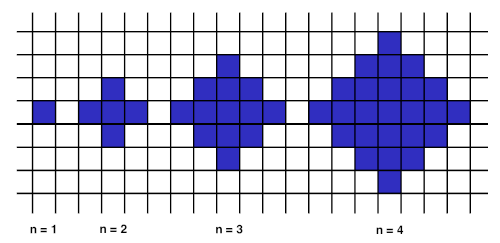

Ir# Área de la figura

|           Puntos          |<span style="font-weight: normal;">10.76</span>|  Tamaño límite de entrada (bytes)  |<span style="font-weight: normal;">32 MiB</span>|
|      :------------:       |               :------------:                  |           :------------:           | :------------: |
|**Límite de tiempo (caso)**|                     1s                        |    **Límite de tiempo (total)**    |      1m0s      |
|     **Entrada/Salida**    |                  Consola                      |**Tamaño límite de entrada (bytes)**|     10 KiB     |


## Descripción
En la UPIIZ-IPN, los chicos y chicas del club de algoritmia del periodo 2020-1 les gusta mucho las figuras y las sucesiones.

Se define un $\large n$-polígono-interesante. Tu tarea es encontrar el área de un polígono dada una $\large n$.

Un $\large 1$-polígono-interesante es sólo un cuadrado con lado de longitud $\large 1$. Un $\large n$-polígono-interesante es obtenido tomando un $\large (n-1)$-polígono-interesante y adjuntando $\large 1$-polígono-interesante en sus bordes, es decir, agregando en cada lado un cuadrado de lado $\large 1$.

En la imagen de abajo se pueden verlos $\large 1-, 2-, 3-, 4-$ polígonos-interesantes.

<figure>
    
</figure>

Escribe un programa que calcule el área de un $\large n$-polígono-interesante.

## Entrada
El numero $\large n$. Puedes suponer que $\large 1 \leq n \leq 10^4$.

## Salida
Un entero que sea el área del $\large n$-polígono-interesante.

## Ejemplo
<table style="text-align: center;" >
    <thead>
        <tr>
            <th>Entrada</th>
            <th>Salida</th>
        </tr>
    </thead>
    <tbody>
        <tr>
            <td>1</td>
            <td>1</td>
        </tr>
        <tr>
            <td>4</td>
            <td>25</td>
        </tr>
    </tbody>
</table>

------------

Fuente: CodeSignal
Subido por: [David Betancourt Montellano (davbetm) (COA21)](https://omegaup.com/profile/davbetm/ "David Betancourt Montellano (davbetm) (COA21)")
Problema subido en: 5/11/2019
Página: omegaup.com

------------

## Solución
### Python
```py
def main () -> None:
    n = int(input())
    area = n ** 2 + (n - 1) ** 2
    print(area)


if __name__ == '__main__':
    main()
```
